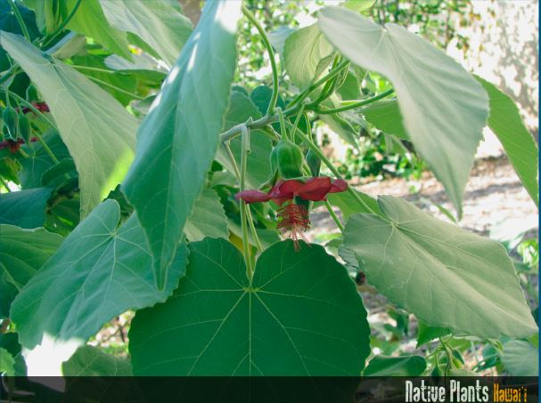
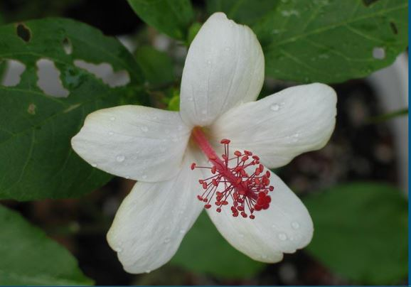
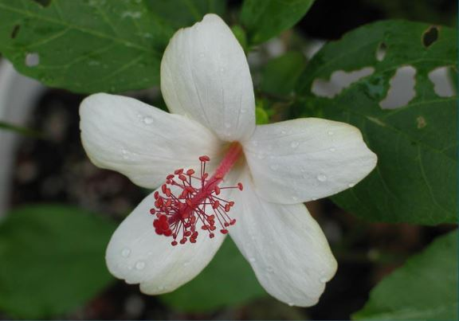
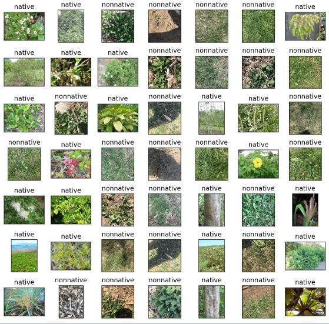
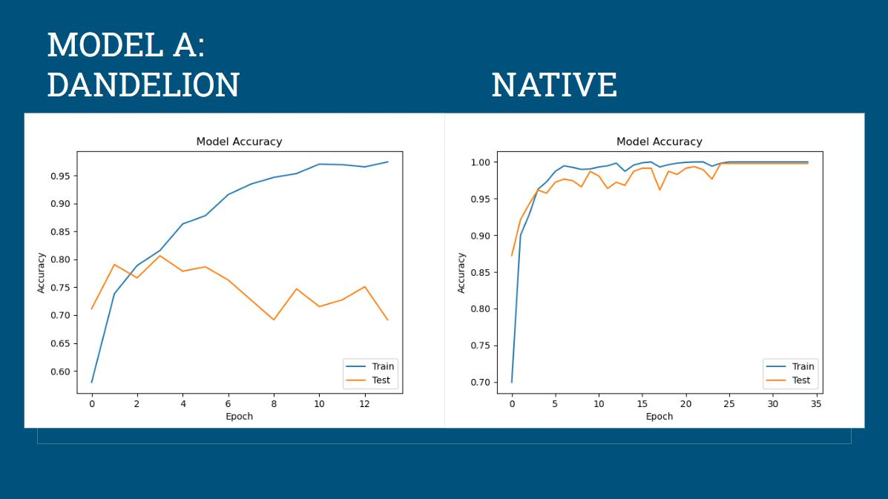
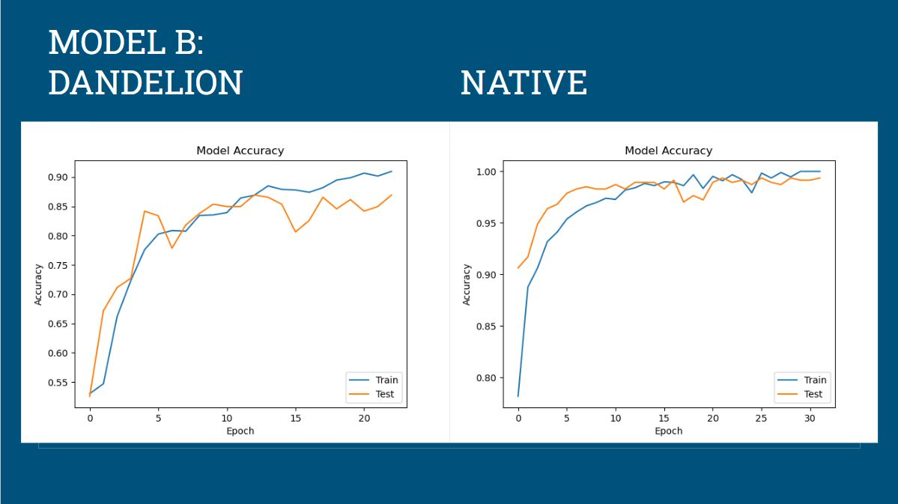
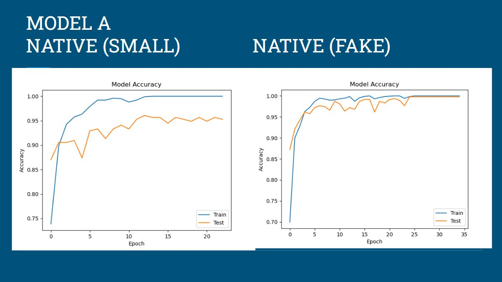

# native_binary_classification
First exposure to deep learning (keras/tensorflow) ~2021

Objective: determine if images are native or non-native plants to Hawaii

### About the data:

For the native plant dataset, I used images from from nativeplants.hawaii.edu. For the non-native plants I used a dandelion dataset from kaggle

Scraping the images online we get a small dataset: 555 pictures of native plants and 635 non-native pictures (dandelion)

Each of the native plant images had a watermark that needed to be removed. If we don't remove the watermark, our model will simply learn that the watermark is a key feature of a native plant, which is obviously not what we want. For each of the native plant images, I cropped out the bottom 40 pixels of the image since each watermark was the same size in each image. 

Because the dataset is so small, I created new data by mirroring along the y axis. Went from 555 native pictures to 1110 and used the rest of dandelion dataset (1265)

  
  

Below is an example of the datasets put together:

### Results

Using model A and model B, I ran on both the datasets to see how the accuracy would improve. I also ran the 2 models on the native dataset with the fake data (mirrored images) and without the fake data (smaller dataset). I ran ~30 epochs on a MacBook Air with an M1 chip, so the computational power was not particularly elite. 

Below is model A on both datasets

Below is model B on both datasets

Below is model A on the native datasets

Below is model B on the native datasets

### Final thoughts/improvements to be made

The biggest problem with this project is that the 2 datasets come from different sources, and are quite different than each other. One way this could be improved is if we had a non-native dataset that had more flowers/plants. The dandelion dataset (non-native) is essentially just pictures of grass, dirt and dandelions; it's very trivial for a machine learning model to find the difference between these two classes. 

There is a lot of code duplication in native.py and dandelion.py and this could have been consolidated much better for both the models and the evaluation. 

### Dataset sources:

https://www.kaggle.com/datasets/coloradokb/dandelionimages

http://nativeplants.hawaii.edu/index/
